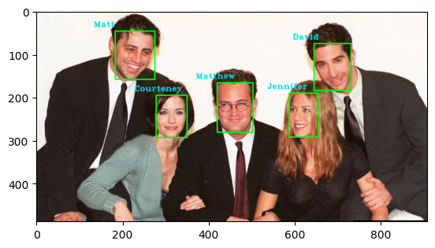
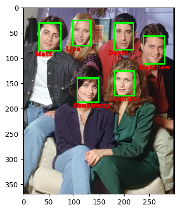
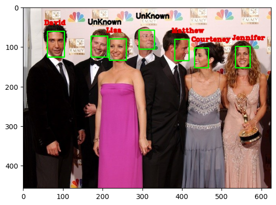

# Face Identification


This technique is commonly used in various applications such as facial recognition systems, facial feature recognition, and emotion recognition. This helps to separate the face from the rest of the image, allowing for more accurate and efficient processing. By drawing frames around faces, it becomes easier to track and analyze facial features, expressions, and other relevant information. This technique plays an important role in various computer vision and image processing applications.


## How to create face bank

We will create a face bank folder containing people whose faces you want to identify faces in. The reason for this naming is that the neural network and mlp are not supposed to be trained with it, we only extract the features of each person's face. 

```
jupyter nbconvert --to python create_face_bank.ipynb
```
Another step-by-step implementation method is as follows:

### create an instance of the CreateFaceBank class
```face_bank_creator = CreateFaceBank()```

### load the face detection and embedding model
```face_bank_creator.load_model()```

### set the path to the directory containing face images
```face_bank_creator.face_bank_path = '/path/to/face/images'```

### extract embeddings for each image and save them to a file
```face_bank_creator.facebank()```

---

## How to install

```
pip install -r requirements.txt
```

## How to use

```
jupyter nbconvert --to python face_identification.ipynb
```
Or do you want to use the Python file, the method is as follows:

To use the code you replicated, you need to run it using a Python interpreter. You can do this by opening a terminal/command prompt and navigating to the directory where the code is saved. Then, you can run the code using the following command:

‍
‍‍‍‍```python face_identification.py --image <path_to_input_image> [--update <path_to_directory_with_new_images>]```

Replace <path_to_input_image> with the path to the input image you want to identify faces in. If you have new images to update the face bank, add the --update flag followed by the path to the directory with the new images.


For example, if your input image is located in the same directory as the code and is called input_image.jpg, you can run the code with the following command:

```python face_identification.py --image input_image.jpg```

If you have new images to update the face bank and they are located in a directory called new_images in the same directory as the code, you can run the code with the following command:

```python face_identification.py --image input_image.jpg --update new_images ```


### results






